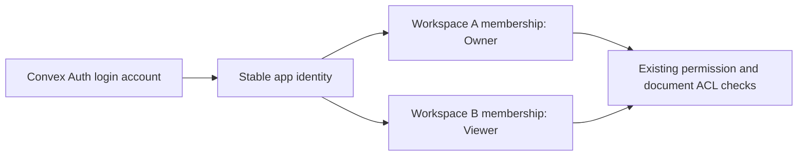

# Authentication hosted in Convex

Evaluated on 2026-10-04 against Societyer `31c185b`. This is a source-backed
migration plan. No broker, production schema, login screen or existing account
binding has been changed by this evaluation.

## Two meanings of hosting authentication in Convex

| Path | Login/session implementation | Where auth data lives | Fit for Societyer |
| --- | --- | --- | --- |
| Convex Auth (`@convex-dev/auth`) | Convex Auth, without Clerk or Better Auth | Auth tables in the app's Convex deployment | Meets the request to remove both libraries; requires a substantial membership-schema migration |
| Convex + Better Auth (`@convex-dev/better-auth`) | Better Auth through the Convex component | Component-scoped Convex tables | Smaller migration when the goal is to remove the separate auth server/database while retaining Better Auth features |
| Current Better Auth broker | Better Auth in the Node gateway, with JWT/JWKS trusted by Convex | Separate auth SQLite database; app identities/memberships in Convex | Preserves the existing tenant-restricted Microsoft login; suitable for Node-dependent enterprise SSO |

Convex Auth is an actual authentication library, not just Convex verifying an
external provider's token. Its docs support passwords (including reset and
optional email verification), email links/codes and OAuth. It does not ship a
complete login or user-management UI. The official docs still mark it **beta**
and warn about possible incompatible changes. Registry versions checked were
Convex Auth `0.0.96` with Auth.js core `0.41.1`, and Convex + Better Auth `0.12.5`.
These are evaluation references, not newly installed application dependencies.

The Better Auth integration registers a Convex component, stores authentication
records through its adapter, exposes auth HTTP routes through Convex, and has a
React/Vite provider. Its docs include self-hosted configuration. Societyer's
installed Convex `1.42.1` and Better Auth `1.6.23` meet the component's published
peer ranges, but that is not runtime qualification or a migration guarantee.

## Microsoft login and enterprise SSO are different integration questions

Better Auth itself supports Microsoft OAuth sign-in. Societyer already uses
this in the Node broker, with a pinned Entra tenant, verified ID tokens,
identity-only scopes, no Graph profile fetch and no implicit account linking.
That provides the company's Microsoft sign-in experience without installing
the generic enterprise SSO plugin.

Better Auth also publishes `@better-auth/sso` for OIDC/OAuth2 and SAML 2.0
connections. **The current Convex integration's supported-plugins page lists
SSO as incompatible, including with Local Install, because it has direct Node.js
dependencies.** A working Better Auth/Convex integration therefore does not
establish that this enterprise SSO plugin can run inside Convex.

For one company Microsoft directory, evaluate the Microsoft OAuth provider in
the Convex component and port the existing tenant/token checks; do not accept
the documentation's generic `common` tenant default. This port has not been
runtime-tested here. For arbitrary customer-configured SAML/OIDC connections,
retain a Node authentication service or another compatible OIDC broker, and
let Convex verify its tokens. A Convex component installation alone is not a
solution to that SSO requirement.

## Societyer's current user model prevents a direct Convex Auth initializer

`convex/tables/platform.ts` defines `users` as **workspace memberships**. Each row
has required `societyId`, role, status, display name and creation time. One person
can have several rows with different authority in different workspaces.

Convex Auth uses its `users` table for **global login accounts** and references
those accounts from its session/account tables. The documented custom schema
can add fields to `users`; it does not provide a drop-in separation of the two
meanings. Spreading `authTables` over our schema would replace our membership
table, while spreading our schema over `authTables` would impose membership
fields on every new login account. Neither ordering is a valid migration.

The preferred native-auth model is:

A global account never conveys an Owner role. Joining a workspace remains an
invitation or explicitly authorized provisioning operation. Matching an email
never transfers an existing membership.

There is also an identity-format difference. Convex Auth `0.0.96` generates JWT
subjects containing **user ID plus session ID**. Its official `getAuthUserId`
helper extracts the stable user ID. Our current principal adapter uses the
raw issuer/subject pair; applying that unchanged would give the same person
different identities after signing in again. The native adapter must derive
the stable account through the verified provider's helper and check the current
session/account lifecycle. Do not reuse a session-dependent subject as a
membership binding or PowerSync database namespace.

## Native Convex Auth implementation pathway

1. **Separate pilot.** Use a new Docker project/volume and test origin alongside
   the existing port-43210 pilot. Pin the released library; do not adopt the
   repository's work-in-progress reboot branch. Add password signup/login and
   sign-out through the library, not hand-written password or session logic.
2. **Separate accounts and memberships.** Reserve `users` for auth accounts and
   migrate existing app memberships to `workspaceMemberships`. Build an explicit
   old-membership-ID to new-membership-ID map before moving references. Update
   every `Id<"users">`, validator, activity actor, invitation, API principal and
   foreign key that means membership. Never reinterpret an old Convex ID as a
   new table's ID. Keep the current app `users` API name if it helps preserve UI
   contracts, but make its implementation operate on memberships.
3. **Provider adapter.** Add an explicit selected `convex-auth` broker to shared
   configuration, the browser provider, backend auth config and principal
   resolution. Verify only the selected issuer and expected audience/algorithm.
   Convert verified native accounts to stable app identities; check disabled
   identity, session expiry/revocation and current workspace membership. Reduce
   the native library's default access-token lifetime to the application's
   chosen bound. A missing broker never becomes an anonymous hosted login.
4. **Account lifecycle UI.** Reuse the existing login/profile/settings layouts
   and accessible mobile/desktop form conventions. Add signup, login, sign-out,
   reset password and email verification. Keep account profile/session actions
   separate from workspace invitations, role changes, suspension/removal and
   the last-active-Owner safeguard. Email delivery/reset verification require a
   configured email provider; a password-only demo is not a complete rollout.
5. **Existing-account migration.** Enrol/link accounts through authenticated,
   audited proof of control or operator provisioning. Record the new verified
   identity explicitly. Do not auto-claim rows by email, copy passwords from
   Clerk, or invent a default Owner when a binding is absent. Preserve existing
   Clerk profiles and bindings until the selected deployment's migration and
   rollback are qualified.
6. **Gateway and sync credentials.** Teach authenticated REST/API calls to verify
   the selected native broker. Replace the Better Auth machine-signing dependency
   on this route with a server-side, permission-checked sync credential issuer.
   Native Convex Auth access tokens have audience `convex`; they cannot simply
   be reused as the current PowerSync service's audience-bound credentials.
   Preserve stable actor/workspace scoping and separate PowerSync local databases
   by deployment and canonical account identity.
7. **Offline and desktop lifecycle.** Signup, password reset and hosted token
   renewal require network access. Offline app startup uses the already-bound
   local dataset and its established access policy, rather than pretending to
   authenticate against an unavailable server. Queue neither passwords nor
   provider tokens in the business outbox. Verify refresh, logout/account
   switching, recovery export and Electron redirect/session storage separately.
8. **Qualification and rollout.** Run the checks below against the live pilot
   and existing regression suite. Back up data, rehearse the ID mapping and
   rollback on a disposable copy, then enable only the explicitly selected
   deployment. Keep the other existing broker configurations functional.

The membership migration is the largest part of this path. Authentication's
`users` table cannot safely substitute for Societyer's membership/role model.

## Better Auth inside Convex implementation pathway

Register `@convex-dev/better-auth` in `convex/convex.config.ts`, configure its
adapter and trusted origin, register its HTTP routes, and use the documented
React/Vite provider/client integration. Move the auth identity/session store
from `server/auth-config.ts`'s SQLite database into the component. Its component
namespace leaves our existing workspace `users` rows and IDs intact.

Map the component's verified auth users to the existing app identity/membership
model through explicit binding and lifecycle handlers. Port password/reset,
session and Microsoft tenant policy before switching traffic. Keep the Node
gateway where it is still needed for APIs and other services; moving the auth
database does not automatically remove that gateway. Review the machine JWT
issuer used by gateway calls and PowerSync rather than assuming the component
exposes our current signing contract.

This is the smaller candidate if the objective is **authentication data hosted
in Convex**. Native Convex Auth is the candidate if **no Better Auth dependency**
is a requirement. Customer-configured enterprise SAML/SSO needs the separate
runtime decision above regardless of which membership model is selected.

## Acceptance checks

- Signup creates a login account without silently granting workspace access;
  invitation acceptance binds only the intended verified identity/workspace.
- Login/profile/reset/verification/sign-out/session renewal work on phone and
  desktop; incorrect credentials, expired/reset-reused tokens and forged or
  foreign-issuer JWTs are rejected.
- Repeated logins/new sessions resolve the same app identity and offline dataset;
  another account's email never claims it. Concurrent sessions and account
  linking follow an explicit tested policy.
- Foreign-workspace reads/writes, Viewer writes and client-asserted role/actor
  changes are denied by the existing authoritative policies.
- Ordinary demotion/removal/disabling preserves the last active Owner; the
  existing incident-disable/recovery path still works.
- Microsoft uses the configured tenant and validated tokens; other tenants,
  consumer tenants, mismatched callback origins and implicit email linking fail.
- Disabled identities/memberships and revoked sessions deny new requests;
  replicated views and pending uploads follow the same current policy.
- Gateway calls and PowerSync use the correct token audience, server-derived
  actor/workspace and current authority. Offline account changes isolate rows,
  files and queued commands.
- Reconciled authentication, authorization, roles and Owner tests, combined build
  and data-migration/rollback rehearsal pass before enabling a new broker.

## Sources

- [Convex Auth overview and beta status](https://labs.convex.dev/auth)
- [Convex authentication options](https://docs.convex.dev/auth)
- [Convex Auth setup](https://labs.convex.dev/auth/setup)
- [Convex Auth custom schema](https://labs.convex.dev/auth/setup/schema)
- [Convex Auth passwords/reset/verification](https://labs.convex.dev/auth/config/passwords)
- [Convex Auth identity/session helpers](https://labs.convex.dev/auth/authz)
- [Convex Auth released token implementation](https://github.com/get-convex/convex-auth/blob/main/src/server/implementation/tokens.ts)
  (subject format also inspected in npm package `0.0.96`)
- [Convex + Better Auth integration](https://labs.convex.dev/better-auth)
- [React/Vite and self-hosted configuration](https://labs.convex.dev/better-auth/framework-guides/react)
- [Supported plugins and SSO incompatibility](https://labs.convex.dev/better-auth/supported-plugins)
- [Better Auth Microsoft provider](https://www.better-auth.com/docs/authentication/microsoft)
- [Better Auth enterprise SSO plugin](https://www.better-auth.com/docs/plugins/sso)

Repository evidence: `convex/tables/platform.ts`, `convex/auth.config.ts`,
`convex/lib/authIdentity.ts`, `shared/authConfiguration.ts`,
`shared/functions/identity.ts`, `shared/functions/users.ts`,
`src/auth/AuthProvider.tsx`, `server/auth-config.ts`, `server/microsoft-sso.ts`,
`server/api-gateway.ts` and the offline pilot's credential adapters.
