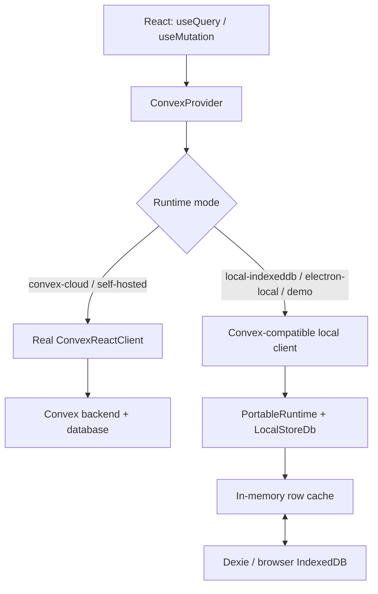

# Database runtime architecture: Convex vs. local IndexedDB

The app does not connect Convex and IndexedDB together. It selects one database runtime at startup:



The important distinction is:

- Convex mode stores data in the Convex backend.
- Local mode stores data in the browser's IndexedDB through Dexie.
- IndexedDB is not a Convex cache, and the `changes` table is not a sync queue.
- Both modes reuse the same React hooks and, for most domain operations, the same business handlers.

## How startup selects the database

The runtime modes are defined in [`src/lib/runtimeMode.ts`](../src/lib/runtimeMode.ts):

- `convex-cloud`
- `convex-self-hosted`
- `local-indexeddb`
- `electron-local`

At startup, [`src/main.tsx`](../src/main.tsx) (`AsyncAppProviders`) dynamically loads either:

- [`src/lib/convex.ts`](../src/lib/convex.ts), which creates a real `ConvexReactClient`, or
- [`src/lib/localDataClient.ts`](../src/lib/localDataClient.ts), which creates the local Dexie-backed client.

Both are passed into the normal `ConvexProvider` in `main.tsx`. This is why pages can always use `useQuery` and `useMutation` without knowing which database is active.

When neither `VITE_RUNTIME_MODE` nor `VITE_CONVEX_URL` is set, a plain `npm run dev` selects `convex-self-hosted` and defaults to:

```text
http://127.0.0.1:3210
```

To run browser-local IndexedDB explicitly:

```bash
VITE_RUNTIME_MODE=local-indexeddb npm run dev
```

Visiting `/demo` also forces the local-data path through [`src/lib/staticRuntime.ts`](../src/lib/staticRuntime.ts).

## What the local IndexedDB contains

The IndexedDB/Dexie schema is in [`src/lib/localDexieRowStore.ts`](../src/lib/localDexieRowStore.ts) (`LocalDexieDatabase`). Its main stores are:

- `records`: generic records for every logical domain table.
- `changes`: capped diagnostic change journal.
- `attachments`: attachment metadata.
- `meta`: workspace and schema metadata.
- `meetings` and `minutes`: legacy/specialized stores retained for compatibility.

Most data is stored in the generic `records` store using an envelope like:

```ts
{
  key: "deadlines:some-id",
  table: "deadlines",
  id: "some-id",
  societyId: "...",
  value: {
    _id: "some-id",
    title: "...",
    // domain fields
  }
}
```

The envelope is constructed by `localRecord()` in `localDexieRowStore.ts`.

A subtle point: queries do not normally read IndexedDB directly. At startup:

1. The seed is copied into an in-memory cache.
2. Dexie asynchronously loads persisted `records`.
3. Those records are merged into the cache.
4. React queries read the cache.
5. Writes update the cache and persist back into IndexedDB.

That hydration process is `LocalDexieRowStore.hydrate()` in `localDexieRowStore.ts`.

## How the same handler works on both databases

Consider deadlines.

The page uses ordinary Convex hooks in [`src/pages/Deadlines.tsx`](../src/pages/Deadlines.tsx):

```ts
const items = useQuery(api.deadlines.list, ...);
const create = useMutation(api.deadlines.create);
```

The actual business logic lives in the portable handler [`shared/functions/deadlines.ts`](../shared/functions/deadlines.ts) (`listPortable`):

```ts
const rows = await ctx.db
  .query("deadlines")
  .withIndex("by_society_due", ...)
  .collect();
```

In Convex mode, [`convex/deadlines.ts`](../convex/deadlines.ts) wraps the real Convex context:

```ts
handler: (ctx, args) =>
  listPortable(toPortableQueryCtx(ctx), args)
```

The Convex adapter maps `ctx.db.query`, `insert`, `patch`, and `delete` to the real Convex database in [`convex/lib/portable.ts`](../convex/lib/portable.ts).

In local mode, the same handler is registered under `deadlines:list` in [`shared/functions/registry.ts`](../shared/functions/registry.ts), then executed by `PortableRuntime` against `LocalStoreDb`.

So the two paths are effectively:

```text
Convex:
shared handler → ConvexPortableDb → real Convex ctx.db

Local:
shared handler → LocalStoreDb → in-memory cache → Dexie/IndexedDB
```

## Local transactions and reactivity

For local mutations, `LocalStoreDb` buffers all changes in a transactional overlay. On success, it sends one batch to Dexie; on failure, the batch is discarded. See `transaction()` in [`shared/portable/localRowStore.ts`](../shared/portable/localRowStore.ts).

The Dexie batch is committed in a single `rw` transaction by `LocalDexieRowStore.commitBatch()` in [`src/lib/localDexieRowStore.ts`](../src/lib/localDexieRowStore.ts).

After a commit:

1. The row store notifies listeners.
2. The local client reruns watched portable queries.
3. Query results are cached.
4. `ConvexProvider` subscribers rerender.

That bridge is implemented by `StaticConvexClient.watchQuery` / `watchPortableQuery` in [`src/lib/staticConvex.ts`](../src/lib/staticConvex.ts).

## Limitations to keep in mind

- Local `withIndex()` generally scans cached rows and applies constraints in JavaScript; Convex uses real database indexes. The index *name* is not validated locally, so a handler referencing a nonexistent index can work locally and fail on Convex.
- The Convex adapter implements `filter(predicate)` as collect-then-filter, so predicate-heavy handlers that feel fine locally can hit Convex scan/bandwidth limits at production data sizes. Prefer index narrowing before predicates.
- Server capabilities such as AI, messaging, network integrations, and some storage actions may be unavailable locally (they throw structured `CAPABILITY_UNAVAILABLE` errors).
- `local-indexeddb` uses demo seed data; `electron-local` uses a workspace client with an empty seed and local filesystem document storage.
- Workspace isolation is based on the Dexie database name, derived in [`src/lib/localWorkspaceAdapter.ts`](../src/lib/localWorkspaceAdapter.ts). `VITE_LOCAL_WORKSPACE_ID` can set a stable custom name.

### Sync stance (decided)

- Local mode is an island. Snapshot export/import is the supported way to move or restore a local workspace.
- The planned upgrade path is one-way promotion of a local workspace into Convex. The design will be documented in [`local-to-convex-promotion.md`](./local-to-convex-promotion.md).
- Two-way synchronization between local mode and Convex is explicitly out of scope.
- The local `changes` store is a capped diagnostic change journal. It is **not** an audit log: entries do not record an actor or before/after values. It is also **not** a sync queue.
- Durable identity across runtimes follows the `entityId` design in [`shared/portable/ids.ts`](../shared/portable/ids.ts); each runtime's native `_id` remains runtime-specific.

## Known gaps / migration status

The local client still contains a legacy generation alongside the portable runtime:

- Functions **not** registered in `PORTABLE_FUNCTIONS` fall back to hand-written demo mocks in `staticConvex.ts` (`mutableQueryResult` / `mutationResult`). These are parallel implementations of business logic and can silently diverge from the shared handlers. The local client logs a `legacy demo fallback` warning the first time each such function is served.
- The legacy per-row write methods on `LocalDexieRowStore` (`upsertRow` / `patchRow` / `removeRow`) persist with fire-and-forget, non-atomic Dexie puts — the exact behavior `commitBatch` was written to fix. Only the legacy mock mutations still use them.
- The in-memory local engine scans full tables per query and re-runs every watched query on any store change. Fine at demo scale; a real ceiling for large `electron-local` workspaces.

The goal state is to delete the legacy paths entirely: every app-called function either registered as a portable handler or explicitly declared server-only via the capabilities system. The full audited backlog (66 functions, sized and batched) is in [`local-portable-migration-backlog.md`](./local-portable-migration-backlog.md).
