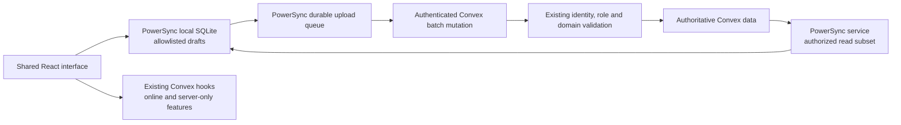

# Offline applications while retaining Convex

Evaluated 2026-10-04 against Societyer `bb513c4`, based on reconciled main
`4b15fd20f3b82baa6b18cb95be7b2c62404884b3`. Required authentication commit
`cc52e24487f42c19f81b2d22385091006bc70b44` is an ancestor. This evaluation adds
an isolated experiment; it does not enable production synchronization.

## Recommendation

Keep Convex as the authoritative backend, the existing Clerk/Better Auth
broker, React Router and the shared domain handlers. Evaluate PowerSync as
the durable local storage and sync owner for an allowlisted draft feature.
Do not expand the custom Convex-compatible client into a general sync engine
before that live evaluation. RxDB is the alternative if operating PowerSync
or relying on its experimental Convex connector is unacceptable; it would
require more server replication integration from us.

An offline standalone workspace and an offline copy of a hosted workspace
are different modes. The current standalone mode remains an independent
database with snapshot import/export. A synced workspace would be a new,
explicitly selected mode. Switching modes must not silently merge data or
upload local users, credentials, integrations or role assignments.

The diagram is the proposed live architecture. The committed experiment tests
the local/queue/upload path using `convex-test`; the PowerSync service/read
replication arrow has **not** been exercised.

## What other projects actually do

Sources were read at pinned commits, rather than treating README claims as
verification of production suitability.

| Project | Observed implementation | Fit for Societyer |
| --- | --- | --- |
| [Actual Budget](https://github.com/actualbudget/actual/tree/3c60bf675ed455a3aa71f4af9139befd855d3ad4) | Shared `loot-core`, SQLite, platform-specific imports, and its own CRDT/protobuf sync protocol. Web database work runs in a worker; Electron has a separate background process. | Borrow its shared-core/platform-adapter structure. Its CRDT package explicitly says external usage is undocumented and at the user's risk; adopting its protocol would retain substantial custom infrastructure. |
| [PowerSync + Convex demo](https://github.com/powersync-community/powersync-convex-todolist-demo/tree/d40348a04f2b187b33fd48db79f270ebb4f8712e) | Real client SQLite, stable UUIDs, PowerSync read replication, and uploads through Convex mutations. Auth uses Convex Auth. | Closest concrete example of retaining Convex. Replace its auth wiring with our existing broker. Its connector uploads operations individually and completes permanently rejected transactions; we require atomic batches and recoverable rejected drafts. |
| [Automerge + Convex quickstart](https://github.com/ianmacartney/automerge-convex-quickstart/tree/18868b810907dccd93ffb5fc6c0f8f83d4706ab8) | Automerge documents persisted in IndexedDB, with Convex carrying document updates. | Useful for collaborative draft text. CRDT convergence does not establish authorization, valid approvals, accounting invariants or successful filings. |
| [Convex Local-First community framework](https://github.com/Fanzzzd/convex-localfirst/tree/51b9f9ba493db38d2ab21ad8bfed012ef161880d) | Shared table declarations, local store, sync functions, atomic write groups and recovery APIs. | Worth watching, but its generic sync mutations cannot automatically preserve Societyer's domain-specific handlers and permissions. Not adopted or runtime-tested here. |
| [Older Convex offline experiment](https://github.com/get-convex/michal-convex-offline-client/tree/32a64546d4acc531dcd2dcf2249ab1f30fb5086f) | Cached query hooks and a custom local database/schema. The inspected main commit dates to December 2023. | An example of the approach we already maintain. Not evidence of a supported replacement for it. |

Actual's architecture is documented [here](https://actualbudget.org/docs/contributing/project-details/architecture).
The inspected CRDT package's external-use warning is in
[its README](https://github.com/actualbudget/actual/blob/3c60bf675ed455a3aa71f4af9139befd855d3ad4/packages/crdt/README.md).

## What keeping Convex requires

1. **Local identities distinct from Convex IDs.** Offline rows need stable
   client-generated UUIDs; Convex keeps its native `_id`. Map references explicitly.
   Societyer's existing `entityId` design is relevant, but it is not yet a universal
   hosted identity column and some tables use that name for a different purpose.
   Start with a new draft table's unambiguous `uuid`; do not mass-rewrite the
   application's existing foreign keys. See the existing
   [promotion design](local-to-convex-promotion.md) for those constraints.
2. **Keep the existing authentication broker.** Convex mutation calls continue
   using the existing authenticated Convex client. PowerSync's `fetchCredentials`
   gets a short-lived token from our authenticated backend, with a trusted
   server-derived identity and the PowerSync instance's required audience.
   Do not copy the demo's Convex Auth subject parsing or trust an actor selected
   by the browser. Clerk profiles and tenant-restricted Microsoft mode remain
   where they are. [PowerSync custom auth](https://docs.powersync.com/configuration/auth/custom).
3. **An authorized replicated read subset.** PowerSync reads the Convex export
   stream, not our query functions. A valid JWT alone does not reproduce query
   ACLs. Sync grants/streams must derive from active, issuer-bound membership,
   applicable resource permissions and record ACLs. Define and test revocation
   and policy changes before any confidential data is replicated. Avoid secrets,
   API keys, signed URLs, sensitive registers and arbitrary full-table replicas.
4. **Uploads are commands subject to current server policy.** Validate every
   batch with existing membership and permission helpers, reject unexpected
   fields/tables, derive audit actors on the server, apply the whole batch in
   one Convex mutation, and record an idempotency receipt in that transaction.
   Check a base revision so stale offline work cannot overwrite newer state.
   Production adoption also registers the new functions in Societyer's central
   action-policy inventory and uses its authorized query/mutation wrappers;
   the isolated sandbox is not a production registry integration.
5. **Visible recovery.** Keep rejected local work. Show a conflict, revoked
   access or unsupported operation, and allow a reviewed resolution/export.
   A permanently rejected item can block a FIFO queue; retaining it proves
   preservation, not a finished recovery UI. Never silently drop a failed filing.
6. **Platform adapters and files.** Use the same feature repository/API in the
   web, PWA and Electron views. A PWA caches its shell; Electron packages it.
   Use an established PWA build/cache integration such as Workbox for production;
   the experiment's small development-shell service worker is only test infrastructure.
   Prefer worker-based local querying. Separately handle attachment bytes,
   local filesystem/IPC, upload queues, content hashes and download availability.
   Test packaged Electron's protocol/CSP/worker paths before choosing renderer
   SQLite versus a native database adapter.

Offline devices can retain previously downloaded information while disconnected;
no sync engine can instantly revoke bytes on a device it cannot reach. Specify
the cache/encryption/logout policy and revalidate before accepting any upload.
Pending offline work is a draft, not a server approval or legal submission.

## Isolated prototype

The [experiment](../experiments/offline-convex/README.md) uses `@powersync/web`
2.4.2, real SQLite backed by IndexedDB and worker-based database access. PowerSync
owns the durable queue; no custom replication engine is implemented.

- Local database names hash deployment, issuer, subject and workspace, avoiding
  cross-account cache reuse and collisions from slug normalization.
- One draft collection stores names and free-text preparation information;
  it does not implement an incorporation form or a filing workflow.
- Persisted operation metadata holds the revision, immutable draft snapshot
  and stable operation ID. Queue entries survive offline reloads.
- The connector sends a full transaction to one Convex mutation and only
  acknowledges acceptance for the still-current session.
- The experimental schema extends Societyer's schema only inside the lab.
  The mutation reuses the actual `toPortableQueryCtx`, verified principal
  resolution and `requirePermissionPortable` helpers.
- Browser fixture identities are explicitly synthetic. Test HTTP routes exist
  only in this separate Vite development server. They are not production auth.
- `convexTransport()` accepts the application's authenticated `ConvexReactClient`;
  this live transport adapter compiles but has not been exercised against a deployment.

## Rollout sequence

1. Complete a disposable live PowerSync/Convex pilot: service connection,
   checkpoint configuration, ID mapping, broker-issued JWT, restricted sync
   streams and two-device read replication. Prove foreign-workspace denial,
   read ACLs, revoked membership and external identity disablement there.
2. Add an opt-in synced-workspace setup choice and a draft-only repository hook.
   Keep the existing standalone and hosted modes intact. Use PowerSync live
   reads for this feature rather than wrapping every Convex hook in another cache.
3. Add sync progress, pending/accepted/replicated states, rejected-operation
   recovery, cache lifecycle and user-directed export. Test real mobile browsers
   and packaged Electron, including close/reopen while disconnected.
4. Expand the allowlist only after each domain has reviewed merge and command
   semantics. Roles, last-active-Owner changes, approvals, money movements and
   automated filings remain server-authoritative operations.

TanStack Query can manage shared HTTP reads where needed. It does not replace
the sync engine. React Router can remain. PowerSync also has Query/DB integrations,
but its TanStack DB integration is currently described as Alpha; neither is
required for this pilot. [Integration docs](https://docs.powersync.com/client-sdks/frameworks/tanstack).

## Validation and limits

Exact verification results are recorded in
[`artifacts/offline/evaluation-results.json`](../artifacts/offline/evaluation-results.json).
The native tests use Convex's test harness; browser tests use actual SQLite,
actual service-worker caching and browser network disconnection, with sandbox
Convex mutation execution on the fixture server.
The development shell is warmed online before the disconnected reload; this
does not test first installation while offline or production PWA update policy.

The Convex connector is explicitly **experimental**, with no guarantee of
continued support or long-term stability. Its read path polls the export delta
endpoint (default one second), rather than using Convex's native live query
subscriptions. [Connector setup](https://docs.powersync.com/configuration/source-db/setup#convex)
and [feature status](https://docs.powersync.com/resources/feature-status).

No configured PowerSync endpoint, service credential or disposable live Convex
deployment was available in the runtime. Live replication, authentication with
real providers, replicated read ACLs, multi-device convergence, packaged Electron,
physical mobile devices, storage eviction, scale/performance and file sync are
unverified. The experiment's conflict UI preserves the blocked queue and displays
the reason; it does not yet resolve conflicts. RxDB and the other community
frameworks were researched, not installed or benchmarked.

## Meeting workflow expansion

The initial prototype described above has now been expanded with a separate
[meeting pilot](offline-meeting-pilot.md): the existing portable domain handlers,
a SQLite row-store adapter, parent/child commands, attachment transfer,
permission-derived download projections, recovery export and a Workbox PWA
build. The initial evidence artifact remains historical; current evidence is
`artifacts/offline/meeting-pilot-results.json`.

The requested live target is the Zoer test host. That deployment is blocked by
the runtime proxy's HTTP 403 denial and missing local/cluster access. The runbook
records the prepared configuration and required live checks. No production
synced mode or live replication is claimed.
